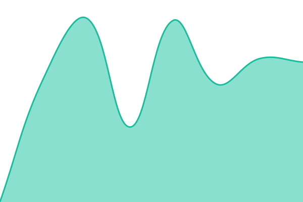
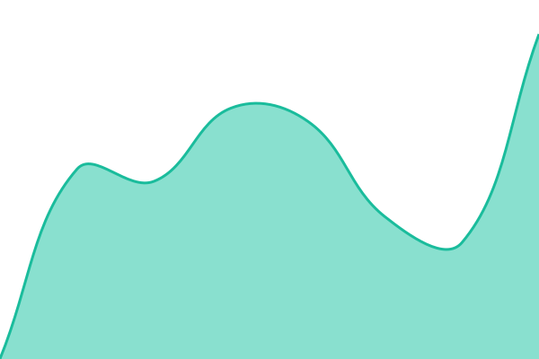

# [📈 Live Status](https://Zefr-Media.github.io/norm-uptime): <!--live status--> **🟩 All systems operational**

This repository contains the open-source uptime monitor and status page for [Zefr Media](https://Zefr-Media.github.io/norm-uptime), powered by [Upptime](https://github.com/upptime/upptime).

With [Upptime](https://upptime.js.org), you can get your own unlimited and free uptime monitor and status page, powered entirely by a GitHub repository. We use [Issues](https://github.com/Zefr-Media/norm-uptime/issues) as incident reports, [Actions](https://github.com/Zefr-Media/norm-uptime/actions) as uptime monitors, and [Pages](https://Zefr-Media.github.io/norm-uptime) for the status page.

<!--start: status pages-->
<!-- This summary is generated by Upptime (https://github.com/upptime/upptime) -->
<!-- Do not edit this manually, your changes will be overwritten -->
<!-- prettier-ignore -->
| URL | Status | History | Response Time | Uptime |
| --- | ------ | ------- | ------------- | ------ |
|  [Sportsbook API](https://sports.norm.game/api/build) | 🟩 Up | [sportsbook-api.yml](https://github.com/Zefr-Media/norm-uptime/commits/HEAD/history/sportsbook-api.yml) | 

 442ms
     
 | 

<a href="https://Zefr-Media.github.io/norm-uptime/history/sportsbook-api">100.00%</a>
    

|  [Sportsbook lines](https://sports.norm.game/api/lines) | 🟩 Up | [sportsbook-lines.yml](https://github.com/Zefr-Media/norm-uptime/commits/HEAD/history/sportsbook-lines.yml) | 

 1125ms
     
 | 

<a href="https://Zefr-Media.github.io/norm-uptime/history/sportsbook-lines">100.00%</a>
    

|  [Casino API (www)](https://www.norm.game/api/build) | 🟩 Up | [casino-api-www.yml](https://github.com/Zefr-Media/norm-uptime/commits/HEAD/history/casino-api-www.yml) | 

 485ms
     
 | 

<a href="https://Zefr-Media.github.io/norm-uptime/history/casino-api-www">100.00%</a>
    

|  [Casino API (casino)](https://casino.norm.game/api/build) | 🟩 Up | [casino-api-casino.yml](https://github.com/Zefr-Media/norm-uptime/commits/HEAD/history/casino-api-casino.yml) | 

 478ms
     
 | 

<a href="https://Zefr-Media.github.io/norm-uptime/history/casino-api-casino">100.00%</a>
    

<!--end: status pages-->

[**Visit our status website →**](https://Zefr-Media.github.io/norm-uptime)

## 📄 License

- Powered by: [Upptime](https://github.com/upptime/upptime)
- Code: [MIT](./LICENSE) © [Anand Chowdhary](https://anandchowdhary.com)
- Data in the `./history` directory: [Open Database License](https://opendatacommons.org/licenses/odbl/1-0/)
